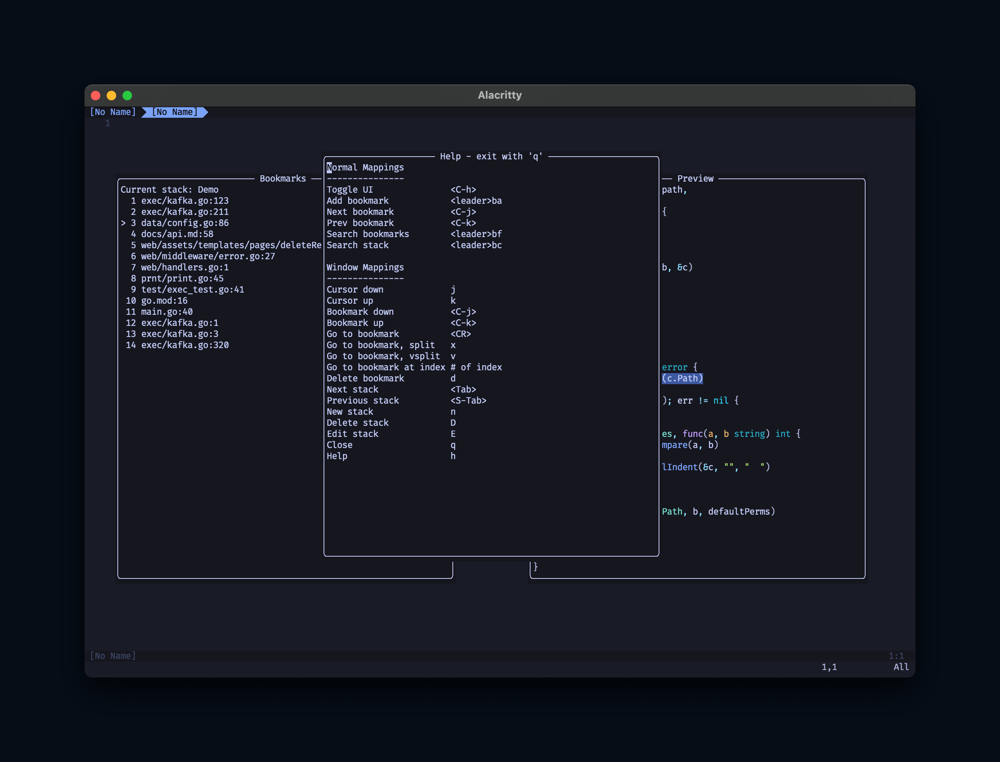

# spelunk.nvim

Marks not cutting it? Create and manage bookmarks more easily, with an easy to use and configurable UI.


## Design Goals
Programming often involves navigating between similar points of interest. Additionally, layers of functionality are often composed together, and thus are often read and edited as part of a stack. `spelunk.nvim` leans into this mental model to allow you to manage bookmarks as related stacks.

`spelunk.nvim` also seeks to take an opinionated approach to configuration. Default keymaps are provided to give the full experience out of the box, as opposed to a build-your-own, API-centric approach. The internal API can also be used for those who would prefer to more deeply customize their experience.

## Features
- Capture and manage bookmarks as stacks of line and column locations
- Opt-in state persistence of bookmarks on a per-directory basis
	- With additional ability to restrict to individual Git branches
- Togglable UI, with contextual and rebindable controls
	- Can also customize layout and panel rendering
- Cycle bookmarks via remappable keybinds
- Jump directly to bookmarks by index
- Fuzzy find over bookmarks and stacks, via:
	- [telescope.nvim](https://github.com/nvim-telescope/telescope.nvim)
	- [snacks.nvim](https://github.com/folke/snacks.nvim)
- Statusline customization - show the number of bookmarks in the current buffer via [lualine.nvim](https://github.com/nvim-lualine/lualine.nvim)
- Also!:
	- Sign column index display
	- Bookmark aliases
	- Show grammar context surrounding bookmarks, via Treesitter integration

See the `faqs/` directory for more custom setup guides.

## Requirements
Neovim (**stable** only) >= 0.11.0

## Installation/Configuration
Via [lazy](https://github.com/folke/lazy.nvim):
```lua
require('lazy').setup({
	{
		'EvWilson/spelunk.nvim',
		dependencies = {
			'nvim-telescope/telescope.nvim',   -- Optional: for fuzzy search capabilities
			'folke/snacks.nvim',               -- Optional: for fuzzy search capabilities
			'nvim-treesitter/nvim-treesitter', -- Optional: for showing grammar context
			'nvim-lualine/lualine.nvim',       -- Optional: for statusline display integration
		},
		config = function()
			require('spelunk').setup({
				enable_persist = true
			})
		end
	}
})
```

Want to configure more keybinds? Pass a config object to the setup function.
Here's the default mapping table for reference:
```lua
{
	base_mappings = {
		-- Toggle the UI open/closed
		toggle = '<leader>bt',
		-- Add a bookmark to the current stack
		add = '<leader>ba',
		-- Delete current line's bookmark from the current stack
		delete = '<leader>bd',
		-- Move to the next bookmark in the stack
		next_bookmark = '<leader>bn',
		-- Move to the previous bookmark in the stack
		prev_bookmark = '<leader>bp',
		-- Fuzzy-find all bookmarks
		search_bookmarks = '<leader>bf',
		-- Fuzzy-find bookmarks in current stack
		search_current_bookmarks = '<leader>bc',
		-- Fuzzy find all stacks
		search_stacks = '<leader>bs',
		-- Change line of hovered bookmark
		change_line = "<leader>bl",
	},
	window_mappings = {
		-- Move the UI cursor down
		cursor_down = 'j',
		-- Move the UI cursor up
		cursor_up = 'k',
		-- Move the current bookmark down in the stack
		bookmark_down = '<C-j>',
		-- Move the current bookmark up in the stack
		bookmark_up = '<C-k>',
		-- Jump to the selected bookmark
		goto_bookmark = '<CR>',
		-- Jump to the selected bookmark in a new vertical split
		goto_bookmark_hsplit = 'x',
		-- Jump to the selected bookmark in a new horizontal split
		goto_bookmark_vsplit = 'v',
		-- Change line of selected bookmark
		change_line = 'l',
		-- Delete the selected bookmark
		delete_bookmark = 'd',
		-- Navigate to the next stack
		next_stack = '<Tab>',
		-- Navigate to the previous stack
		previous_stack = '<S-Tab>',
		-- Create a new stack
		new_stack = 'n',
		-- Delete the current stack
		delete_stack = 'D',
		-- Rename the current stack
		edit_stack = 'E',
		-- Close the UI
		close = 'q',
		-- Open the help menu
		help = 'h',
	},
	-- Flag to enable directory-scoped bookmark persistence
	enable_persist = false,
	-- Prefix for the Lualine integration
	-- (Change this if your terminal emulator lacks emoji support)
	statusline_prefix = '🔖',
	-- Set UI orientation
	-- Advanced customization: you may set your own layout provider for fine-grained control over layout
	-- See `layout.lua` for guidance on setting this up
	---@type 'vertical' | 'horizontal' | LayoutProvider
	orientation = 'vertical',
	-- Enable to show bookmark index in status column
	enable_status_col_display = false,
	-- The character rendered before the currently selected bookmark in the UI
	cursor_character = '>',
	-- Set whether or not to persist bookmarks per git branch
	persist_by_git_branch = false,
	-- Optional provider to use to power fuzzy searching capabilities
	-- This can also be explicitly disabled
	---@type 'telescope' | 'snacks' | 'fzf-lua' | 'disabled'
	fuzzy_search_provider = 'telescope',
}
```

Want to not set a keybind for a given action? Set the bound value to `'NONE'` and it will skip being set.
Keybinds can be set to either individual strings or arrays of strings, so for example `window_mappings.cursor_down` above could be mapped to `{ 'j', '<leader>s' }`.

Check the mentioned help screen to see current keybinds and their use:



## API Documentation
Here be dragons! This plugin is designed with the default bindings and experience in mind, so API stability is not guaranteed.

That said, there are many functions available within `init.lua` which can be called like such from within Neovim Lua code:
```lua
require('spelunk').setup(opts)
```

If there is additional functionality you'd like to see added or exposed, please feel free to open an issue!

### API Questions?
Some examples are available in the [`faqs`](faqs/) directory. If there's something you'd like to know how to do, please open an issue and we can see about implementing it!

Currently there are guides on:
- Providing a custom formatter for display filenames
- Overriding the display function altogether to show Treesitter context instead of bookmark location
- Not rendering the preview UI pane, which applies to all UI panes
- Setting custom aliases for bookmarks
- [lualine.nvim](https://github.com/nvim-lualine/lualine.nvim) integration
